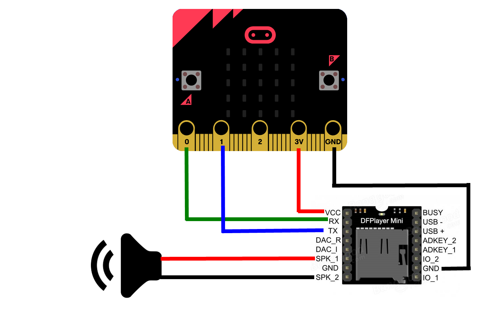

# FarmDeck Documentations 
'Automation for Peace of Mind'
FarmDeck Extensions
To import this extension, go to Advanced -> +Extension copy/paste https://github.com/JJSeah/pxt-FarmDeck into the search box. Press enter and click the extension.

## FarmDeck_Temperature 
### Blocks
```
basic.forever(function () {
    FarmDeck_Temperature.queryData(
    DHTtype.DHT22,
    DigitalPin.P0,
    true,
    false,
    true
    )
})
```
### Sensor versions and wiring

DHT22s have PCB boards, built-in pull up resistors and only 3 pins.
For the PCB version it's easy: Vcc (+) to 3.3V or 5V (both works), GND (-) to GND, Data (out) to any GPIO pins you like.

## FarmDeck_LightSensor 
### Basic usage
```
basic.forever(function () {
    FarmDeck_LightSensor.on()
    FarmDeck_LightSensor.SetAddress(ADDRESS.A35)
    basic.showNumber(FarmDeck_LightSensor.getIntensity())
})
```
### I2C Address  
- 35/92 

### Wiring 
Follow I²C wiring.
Vcc (+) to 3V, GND (-) to GND, SDA to SDA, SCL to SCL.

## FarmDeck_MP3
### Wiring 
Follow the Wiring as seen in the image below.


##### The filesystem in the microSD card
The mp3 files in the microSD card must follow the rules in the image stated below. 
.jpg)

## FarmDeck_Motor
180 Degrees Motor. Range 0º to 180º.
### Basic usage
Code from FarmDeck 
```
basic.forever(function () {
    FarmDeck.Servo(FarmDeck.Servos.S1, 180)
})
```
### Wiring 
Vcc (Red) to 5V, GND (Brown) to GND, PWM input to any Servo Ports you like.

